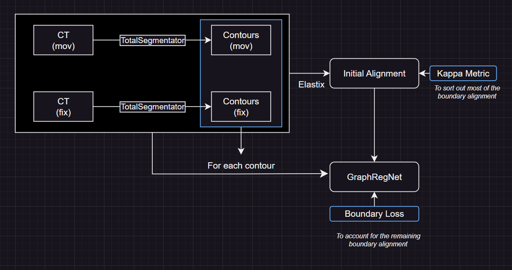

# Undersatnding GraphRegNet

This branch is to run and understand the parts of GraphRegNet.

## A big picture
This is a two stage process:
1. Using `Elastix` to do the initial alignment.
1. Use `GraphRegNet` to refine the local regions.

Source Draw.io file: `rsc\workflow.drawio` (can be edited by Draw.io Integration plugin in VS Code)

## Parts that can be replaced
`GraphRegNet` is designed for the lung. To adapt to other organs, different options can be tried for
* The MIND feature: perhaps some pre-trained CNN filters as a feature extractor (more on this later)
* Loss: can add a term to match the boundary
* Search grid: currently it's 15 x 15 x 15. If the organ is very small, then the search grid can be smaller.

## Test run
A test run using a simplie example is done in [Colab](https://colab.research.google.com/drive/1zWPZdNTqcCbjF2BjF63bU4-WtWnIukZh?usp=sharing).

Data and other outputs can be found in `exp`.

### Findings
* Loss is decreasing with epoch.
* The deformation field converges during 300 - 400 epochs. 
* The lung areas are mostly aligned.
* Some boundaries are not well aligned. 

## Feature extraction network
Here's a way to train a modality independent feature extractor, assuming we have co-registered data.

Imagine we have two modalities, CT and MRI, and we want a filter $F$ such that
* $F$ can take either CT or MRI as the input.
* $F$ should return a similar output (ideally the same output) regardless of the input type.

Being modality independent is not hard - a filter can take anything and output a blank image. The hard part is to maintain the useful feature while being modality independent.

To main the information, the training process should be responsible to keep the filter on the right track.

### Design
Use an autoencoder design:
* the encoder can **randomly** take a CT or MRI;
* the decoder will **randomly** restore the information back to CT or MRI;
* the loss can be MSE with the ground truth.

This forces the encoder to convert the input to a representation which should be informative enough to restore to either MRI or CT. This ensures information is mostly retained.

At the end, the encoder should be a modality independent feature extractor.

### Dataset
* https://synthrad2023.grand-challenge.org/
    * Data: https://zenodo.org/record/7260705#.ZHA6PXZByUk
* https://www.kaggle.com/datasets/chenghanpu/brain-tumor-mri-and-ct-scan